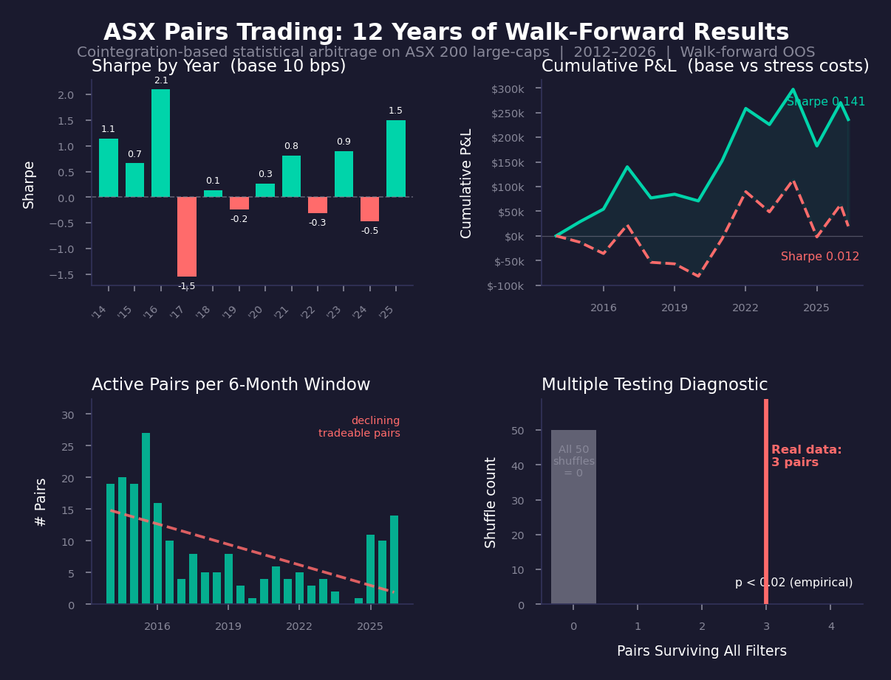

# ASX 200 Statistical Arbitrage

A research project on cointegration-based pairs trading in Australian equities. The methodology is textbook (Engle-Granger pair selection, Ornstein-Uhlenbeck spread modelling, walk-forward out-of-sample testing). The contribution is applying it carefully to a market that's underrepresented in retail quant projects, and being explicit about where the strategy works, where it fails, and what would inflate the results if I weren't paying attention.

**Short answer: the screen finds real cointegration, but the strategy is not tradable net of costs.** The full writeup is in [reports/writeup.md](reports/writeup.md).

## Results

Walk-forward out-of-sample, January 2014 to April 2026 (training data from 2012). 25 six-month trading windows, 447 trades, $1M notional, 45 ASX large-caps.



| | Base (10bps per side) | Stress (25bps per side) |
|---|---|---|
| Sharpe | 0.14 | 0.01 |
| Net PnL | $236k | $19k |
| Share of ~$380k gross PnL lost to costs | 38% | 95% |

- **Sharpe fell after 2016.** 2014 to 2016 averaged 1.30, with 2016 at 2.10. 2017 dropped to -1.54 and the strategy has alternated between positive and negative years since. A regression of annual Sharpe on year gives a slope of -0.11 per year (t = -1.25, p = 0.24). The direction is clear but it isn't statistically significant on 12 observations, and I'm not going to pretend otherwise.
- **Costs eat the edge.** At 25bps per side, 95% of gross PnL goes to costs. Even at 10bps a Sharpe of 0.14 isn't worth running. The strategy only works with institutional execution, and at that point you'd want intraday data anyway.
- **Placebo test: 0 of 50.** Shuffling returns and re-running the full screen (BH, half-life, Hurst) on 2018 to 2020 data produced zero surviving pairs in all 50 shuffles, against 3 on real data (empirical p < 0.02). The relationships are real. They just aren't profitable after costs.
- **Time stops are expensive.** 55% of trades exited on mean reversion, 31% on the 2x half-life time stop, 3% on the hard stop. The time-stopped trades paid full round-trip costs for no convergence.
- **Tradeable pairs dried up.** Pairs passing all filters fell from 16 to 27 per window in 2014 and 2015 to eight or fewer in every window from 2017 to 2024, including zero in H1 2024. They came back to 10 to 14 in 2025, which is also the year Sharpe recovered to 1.50.
- **Capacity is small.** At 1% of ADV the median pair supports about $254k, and the tightest about $135k. This doesn't scale.

Verdict: not tradable net of costs.

## Research questions

1. Are there genuine cointegrating relationships among large-cap ASX names that survive out-of-sample testing once multiple-testing correction is applied?
2. After 40bps and 100bps round-trip costs, does the strategy clear a meaningful Sharpe?
3. Has the alpha decayed since 2015 as ETF flows and electronification have grown?
4. What's the practical capacity ceiling for a strategy of this kind on this market?

## Why ASX

Most public statistical arbitrage projects use US equities, where the methodology has been picked clean and the marginal student write-up adds little. The Australian market is structurally different in ways that matter for pairs trading:

- The big four banks (CBA, WBC, ANZ, NAB) are unusually concentrated and historically traded as a tight bloc, with their relative pricing driven more by capital ratios and dividend yield than by earnings surprises.
- Iron ore exposure dominates the materials sector through BHP, RIO, FMG, and a long tail of single-commodity miners. That's a tighter common factor than US materials.
- The REIT sector has high cluster density (GMG, SCG, SGP, DXS, MGR, VCX, CHC), and rate-sensitivity is more uniform than in US REITs.
- Cross-listings with NZX and CDIs create some interesting arbitrage geometry.

These features make ASX a reasonable place to look for cointegration that isn't already arbitraged away. Whether the alpha actually survives transaction costs is an empirical question, which is what this project is trying to answer.

## Methodology

### Data

Daily OHLCV from yfinance, January 2010 to present. yfinance handles splits but its corporate action coverage is imperfect, particularly for demergers (Coles out of Wesfarmers in 2018, Endeavour out of Woolworths in 2021). Affected periods are excluded from cointegration tests for the relevant tickers.

### Universe

45 large-cap names grouped by GICS sector. Sectors covered: Financials, Insurance, Materials (iron ore, gold, diversified), REITs, Energy, Healthcare, Consumer Staples, Telecom. Constituents are listed in `src/data.py`.

I am deliberately not using the full ASX 200. Pairs trading benefits from same-sector pair candidates, and a wider universe mostly adds multiple-testing burden without finding new economic relationships.

### Pair selection

For each within-sector pair:

1. Engle-Granger two-step regression on log prices to estimate the cointegrating vector.
2. Augmented Dickey-Fuller test on the regression residuals.
3. Benjamini-Hochberg correction across all pairs in the screening window (FDR controlled at 10%).
4. Half-life filter: keep only pairs with mean-reversion half-life between 5 and 60 trading days.
5. Hurst exponent filter: keep only pairs with H < 0.5 (anti-persistent / mean-reverting).

### Spread modelling

For each surviving pair, the spread `s_t = log(P1_t) - β · log(P2_t) - α` is modelled as an Ornstein-Uhlenbeck process:

```
ds_t = θ(μ - s_t) dt + σ dW_t
```

OU parameters are estimated by AR(1) regression on the discretised spread. Half-life is computed as `ln(2) / θ`.

### Signal generation

Standard z-score with rolling 60-day window:

- Enter long spread when z ≤ -2, short spread when z ≥ +2
- Exit when |z| ≤ 0.5
- Hard stop at |z| ≥ 4 (regime change protection)
- Time-based stop at 2 × half-life (the spread isn't reverting)

### Position sizing

Equal dollar both legs, scaled by inverse spread volatility so each pair contributes similar risk to the portfolio. Max 10 concurrent pairs to limit concentration.

### Backtest

Walk-forward, no peeking:

- Training window: 24 months for cointegration discovery and OU calibration
- Trading window: next 6 months, out-of-sample only
- Rolled every 6 months with refresh of pair universe and parameters

No pair is ever traded in the same window it was selected on.

### Costs

Two scenarios:

- Base: 10bps per side per leg (so 40bps round-trip per pair). Approximately retail brokerage plus typical large-cap ASX bid-ask spread.
- Stress: 25bps per side (100bps round-trip). Used to test whether the edge is fragile to cost assumptions.

I am not modelling queue position or market impact at this stage. This is a known limitation, called out below.

## Honest limitations

This section exists because most student backtest projects don't have one, and that's why most of them shouldn't be trusted. Here's what would make this project look better than it is, and how I've tried to avoid it.

**Survivorship bias.** The universe uses currently-listed ASX names. Companies that delisted, were acquired, or fell out of the ASX 200 are not in the sample. This biases backtest returns upward because surviving companies have, by definition, not gone to zero. I've flagged this in every results table rather than waving it away. A future extension would pull historical index constituents from S&P/ASX index files, but free historical constituent data is genuinely scarce.

**Multiple testing.** The current universe gives 94 within-sector pairs per screening window. At a naive 5% significance threshold I'd expect ~5 false positives by chance. Benjamini-Hochberg correction at 10% FDR partially controls this within a window, but multiple testing across rolling windows compounds it further. The reported out-of-sample Sharpe should be read with this in mind.

**In-sample fit on cointegration.** Cointegrating relationships that exist in a 24-month training window may break in the trading window. This is the central failure mode of pairs trading and is exactly what walk-forward is meant to expose. If the gap between training-window Sharpe and trading-window Sharpe is large, the strategy is overfitting.

**Look-ahead bias in costs.** Spread costs are modelled as a flat per-side rate rather than from observed quotes. For a project at this fidelity that's reasonable; for a real strategy you'd want LOB-level cost modelling.

**Capacity.** Pairs trading capacity is bounded by the smaller of the two stocks' average daily volume. For ASX small-mid caps in the universe, this is genuinely tight. `reports/figures/capacity_analysis.png` works through this rather than assuming the strategy scales: median pair capacity is about $254k at 1% of ADV.

**Regime changes and alpha decay.** The hypothesis going in was that ETF flows have compressed within-sector dispersion and made cointegration relationships more fragile. Sharpe did fall after 2016, but the decay regression isn't significant (p = 0.24), so the ETF story is a plausible explanation rather than a demonstrated one.

## Repository structure

```
asx-statarb/
├── README.md                  # This file
├── requirements.txt
├── src/
│   ├── data.py                # Universe, fetch, QC
│   ├── cointegration.py       # Engle-Granger, ADF, BH correction, pair screen
│   ├── filters.py             # Hurst exponent (DFA)
│   ├── ou_process.py          # OU calibration, half-life
│   ├── signals.py             # Z-score signals, entry/exit logic
│   ├── sizing.py              # Hedge-ratio legs, inverse-vol allocation
│   ├── backtest.py            # Walk-forward engine
│   ├── costs.py               # Cost models
│   └── analysis.py            # Decay regression, placebo test, capacity
├── notebooks/                 # One notebook per phase (02 to 05), outputs included
├── scripts/                   # Summary figure generation
├── data/                      # Cached parquet (gitignored)
├── reports/                   # Writeup and figures
└── tests/                     # pytest suite
```

## How to run

```bash
pip install -r requirements.txt
python -m src.data  # Downloads universe, runs QC, caches to data/
pytest tests/
```

Then run `notebooks/04_backtest.ipynb` for the walk-forward backtest and `notebooks/05_analysis.ipynb` for the decay, placebo and capacity analysis. Results are cached to `data/results/`.

## References

- Engle, R. F. and Granger, C. W. J. (1987). Co-integration and error correction.
- Vidyamurthy, G. (2004). Pairs Trading: Quantitative Methods and Analysis.
- López de Prado, M. (2018). Advances in Financial Machine Learning. (Specifically the chapters on backtest overfitting and Deflated Sharpe.)
- Benjamini, Y. and Hochberg, Y. (1995). Controlling the false discovery rate.
